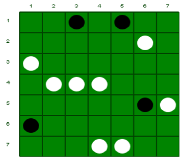
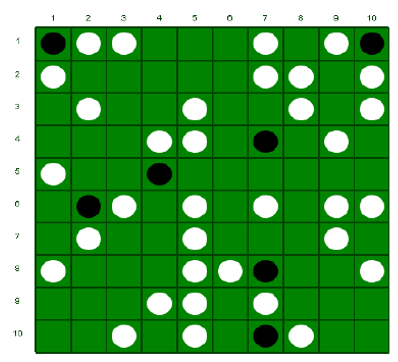

# masyu-solver

## Introduction

A solver for [Masyu](http://www.nikoli.co.jp/en/puzzles/masyu.html) Puzzles. The goal of this project is to make masyu solver using restriction-based algorithm.

## Requirements

* Python3 (tested on python 3.7 and 3.13)
* OpenCV for python 3

## Usage

Setup `venv`

```bash
python3 -m venv venv
source venv/bin/activate
python3 -m pip install -r requirements.txt
```

```bash
python3 masyu.py --image <input-file> --size <board-size>
```

or

```bash
python3 masyu.py -i <input-file> -s <board-size>
```

for example:

```bash
python3 masyu.py -i input1.png -s 7,7
Board init complete!
01     |0125   |0125   |0125   |0125   |0125   |02     |
0146   |0123456|0123456|0123456|0123456|0123456|0236   |
0146   |0123456|0123456|0123456|0123456|0123456|0236   |
0146   |0123456|0123456|0123456|0123456|0123456|0236   |
0146   |0123456|0123456|0123456|0123456|0123456|0236   |
0146   |0123456|0123456|0123456|0123456|0123456|0236   |
04     |0345   |0345   |0345   |0345   |0345   |03     |

Pearl loaded!
01     |0125   |12     |0125   |12     |0125   |02     |
0146   |0123456|0123456|0123456|0123456|56     |0236   |
6      |0123456|0123456|0123456|0123456|0123456|0236   |
0146   |56     |56     |56     |0123456|0123456|0236   |
0146   |0123456|0123456|0123456|0123456|23     |6      |
4      |0123456|0123456|0123456|0123456|0123456|0236   |
04     |0345   |0345   |5      |5      |0345   |03     |

Line extended!
0      |0      |1      |5      |2      |1      |2      |
1      |2      |6      |0      |6      |6      |6      |
6      |6      |6      |1      |3      |6      |6      |
6      |6      |6      |6      |0      |6      |6      |
6      |4      |3      |4      |5      |3      |6      |
4      |5      |2      |0      |0      |1      |3      |
0      |0      |4      |5      |5      |3      |0      |

Here is the solution:
--0-0--
-----1-
1------
-111---
-----01
0------
---11--
0      |0      |1      |5      |2      |1      |2      |
1      |2      |6      |0      |6      |6      |6      |
6      |6      |6      |1      |3      |6      |6      |
6      |6      |6      |6      |0      |6      |6      |
6      |4      |3      |4      |5      |3      |6      |
4      |5      |2      |0      |0      |1      |3      |
0      |0      |4      |5      |5      |3      |0      |

Finished! Time taken: 0.0010671615600585938 seconds
```

image example:

input1.png



```bash
python3 image_extract.py
--0-0--
-----1-
1------
-111---
-----01
0------
---11--
```

input2.png




## To-Do

- no need to refer size of board
- input from stdin
- finish recursive backtracking algorithm after global restriction on board

## Acknowledgment

I made this solver to fulfill IF2120 Discrete Mathematics subject.
